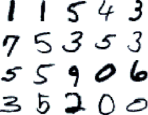
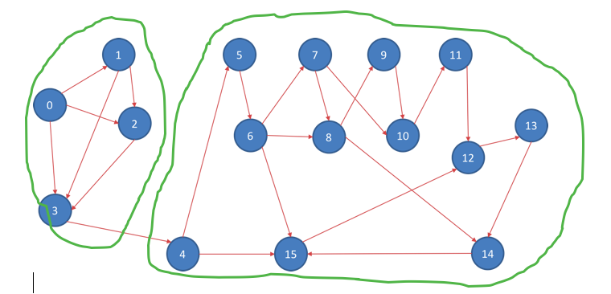

{width="1.6333333333333333in" height="1.2652777777777777in"}Part 1 - MNIST Clustering Example
==================================================================================================================

The MNIST dataset of handwritten digits (derived from a larger dataset
called NIST). Its initial purpose was to train classifiers to understand
hand-written postal addresses.

Each image is of size 28 x 28, where each pixel value is between 0 –
255. This tutorial walks you through how to apply KMeans to cluster
these images.

***Step 1 – Feature Extraction***

First, we need to decide how to extract features from the raw images.
One idea is to transform the 2-D image (28 x 28) into a flat vector (of
size 784). The vector values must be normalized so that each entry is
between 0 and 1.

{width="0.9520833333333333in"
height="0.7188418635170604in"}

We will use the sum squared euclidian distance to compare two vectors.
$\text{Given}\ X = \left\{ x_{1}\ ,\ x_{2},\ \cdots,\ x_{784} \right\}$
and $Y = \left\{ y_{1}\ ,\ y_{2},\ \cdots,\ y_{784} \right\}$, the
distance between the two vectors is given by: *d( X , Y ) =*
$\sum_{i = 1}^{784}{\ (x_{i} - y_{i})}^{2}$

***Step 2 – Train KMeans***

We will use PYSpark and MLlib for this problem. Will feed-in the raw
data to KMeans and train the model, and then evaluate the resulting
model.

You can download the data from : <http://yann.lecun.com/exdb/mnist/>

**Sample Code **

> mnist\_train = sc.textFile(fileNameTrain) \# ingest the comma
> delimited file
>
> def parsePoint(line):
>
> values = line.split(',’)
>
> values = \[0 if e == '' else int(e) for e in values\]
>
> return values\[1:\] *\# values\[0\] is the label, which can be
> discarded*
>
> mnist\_train = mnist\_train.filter(lambda x:x !=header) *\# remove the
> header (1^st^ line)*
>
> parsedData = data.map(parsePoint) *\# parse file into a RDD of lists *
>
> clusters = KMeans.train(trainingData, 2,
> maxIterations=10,initializationMode="random")

Once we have obtained the clusters, we can compute the sum of squared
distances using:

clusters.computeCost( data )

Given a new data point, to classify which cluster this data point
belongs to, we can use :

clusters.predict ( data )

Code is given by MNIST\_Kmeans.py. To run the example using Spark, type:

&lt;path-to-spark&gt;/bin/spark-submit MNIST\_KMeans.py

Note, if you wanted to apply hierarchical clustering, then use Bisecting
KMeans instead.

***Part 2 – LDA for Document Clustering ***
===========================================

Consider the problem of clustering documents, possibly based on topics.
One approach is to apply the standard KMeans algorithm using Cosine
Similarity measure to generate the clusters. Unfortunately, PySpark’s
KMeans only uses a Euclidean measure, so its not appropriate for this
problem. So, let us consider another approach.

Latent Dirichlet allocation (LDA) is a [topic
model](http://en.wikipedia.org/wiki/Topic_model) that generates topics
based on word frequency from a set of documents. LDA is particularly
useful for finding reasonably accurate mixtures of topics within a given
document set.

LDA assumes documents are produced from a mixture of topics. Those
topics then generate words based on their probability distribution. In
other words, LDA assumes a document is made from the following steps:

1.  Determine the number of words in a document. Let’s say our document
    has 6 words.

2.  Determine the mixture of topics in that document. For example, the
    document might contain 1/2 the topic “health” and 1/2 the topic
    “vegetables.”

3.  Using each topic’s multinomial distribution, output words to fill
    the document’s word slots. In our example, the “health” topic is 1/2
    our document, or 3 words. The “health” topic might have the word
    “diet” at 20% probability or “exercise” at 15%, so it will fill the
    document word slots based on those probabilities.

Given this assumption of how documents are created, LDA backtracks and
tries to figure out what topics would create those documents in the
first place.

Data cleaning is absolutely crucial for generating a useful topic model:
as the saying goes, “garbage in, garbage out.” The steps below are
common to most natural language processing methods:

-   Tokenizing: converting a document to its atomic elements.

-   Stopping: removing meaningless words.

See Topics\_LDA.py

*Part 3 – Clustering Tweets By Language *
=========================================

Tweets are mostly raw, not tagged with geo location or language. One
task is to use KMeans to cluster a training set of tweets by language.
Then, given a new tweet, classify the cluster this tweet belongs to and
hence classify the language of the tweet.

The full tutorial is found here:
<https://databricks.gitbooks.io/databricks-spark-reference-applications/twitter_classifier/index.html>

*Part 4 – Power Iteration Clustering*
=====================================

KMeans has several weaknesses, including:

-   Assumes that clusters are of spherical shape

    {width="5.008254593175853in"
    height="0.7639709098862643in"}

-   Assume that clusters are of equal size

    {width="5.4222222222222225in" height="0.8in"}

-   Sensitive to outliers

    {width="5.424921259842519in"
    height="0.602769028871391in"}

Spectral clustering is another method that use the eigenvectors of a
graph Laplacian matrix 𝐿(𝐺) to cluster a graph.

Given: data points 𝑥𝑖 and a similarity function s(𝑥~𝑖~ , 𝑥~𝑖~) between
them, 𝑘

1\. Construct (normalized) graph Laplacian 𝐿 (𝐺 (𝑉, 𝐸)) = 𝐷 − 𝑊

2\. Find the 𝑘 eigenvectors corresponding to the 𝑘 smallest eigenvalues
of 𝐿

3\. Let U be the n × 𝑘 matrix of eigenvectors

4\. Use 𝑘-means to find 𝑘 clusters 𝐶′ letting $x_{i}^{'}$ be the rows of
U

5\. Assign data point 𝑥~𝑖~ to the 𝑗th cluster if $x_{i}^{'}$ was assigned
to cluster 𝑗

{width="4.93125in" height="2.2375021872265966in"}

Power Iteration Clustering is a spectral clustering method for
clustering vertices of a graph given pairwise similarities as edge
properties, described in [Lin and Cohen, Power Iteration
Clustering](http://www.icml2010.org/papers/387.pdf).

Assume we have the above graph, we can see that there are basically two
cliques in the graph assuming that each edge has an equal weight. Our
goal is to find a “cut” or “cuts” in the graph.

Graph\_pic.py provides example code.
